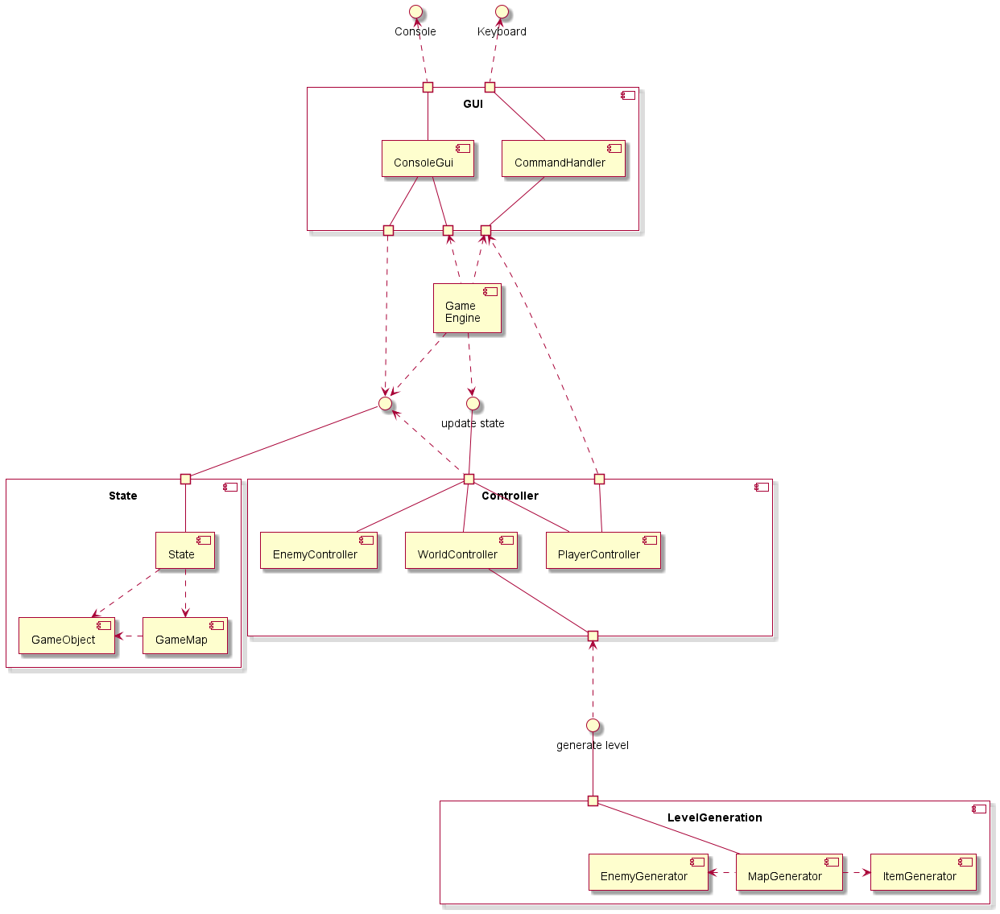
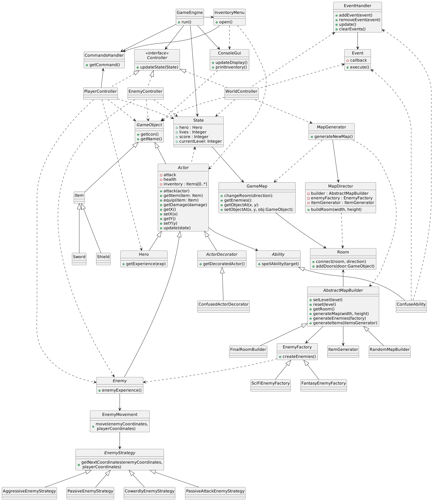
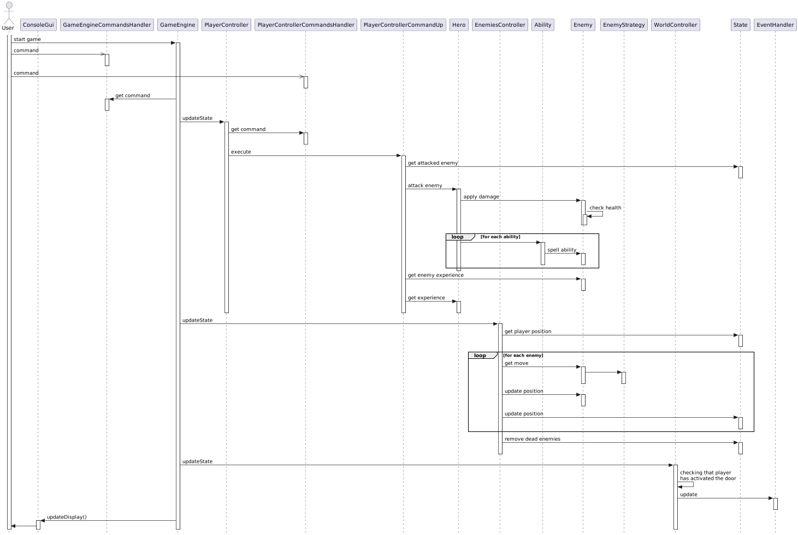

# Design Document

## Общие сведения о системе

Игра представляет собой консольную игру RogueLike, разработанную на Python. Игрок управляет
отважным мальчиком. Он отправился в опасное приключение в пещеру,
чтобы спасти принцессу, которая, как говорят, находится там в плену. Карта
игры генерируется случайным образом, но некоторые уровни загружаются из файлов.
У персонажа игрока есть такие характеристики, как здоровье и сила атаки, влияющие
на игровой процесс. У игрока есть инвентарь предметов, которые можно подобрать с карты
и использовать для улучшения характеристик персонажа. Карта состоит из коридоров с комнатами
и лабиринтов с врагами.
Графика игры традиционна для жанра RogueLike и представлена в виде символов консоли.

## Architectural drivers

- Простота кода: код должен быть простым и легко читаемым, с хорошо организованными и модульными компонентами, чтобы его
  было легче поддерживать и модифицировать с течением времени.

- Процедурная генерация: Алгоритмы процедурной генерации следует использовать для генерации случайных карт, врагов и
  снаряжения. Эти алгоритмы должны быть эффективными и давать интересные и разнообразные результаты для того, чтобы
  игровой процесс отличался от предыдущих игровых сессий.

- Баланс: случайно сгенерированный контент должен быть сбалансирован и не ставить игрока несправедливо в невыгодное
  положение. Сложность врагов и редкость снаряжения должны быть откалиброваны, чтобы обеспечить честный и приятный
  игровой процесс.

- Совместимость с платформами: игра должна быть разработана для работы на нескольких платформах, включая Windows, Linux
  и macOS, с минимальными изменениями.

## Роли

- Игрок: игрок является основным пользователем игры, управляющим персонажем главного героя и перемещающимся по игровому
  миру.

- Разработчик игры: Разработчик игры отвечает за создание, обслуживание и обновление игрового программного обеспечения и
  контента.

## Случаи использования

Игрок запускает игру в консоли и пытается пройти как можно дальше по случайно
сгенерированному игровому миру, перемещая персонажа, участвуя в бою и управляя инвентарем.
В ходе исследования подземелья игрок может собирать монеты и таким образом улучшать
свой результат.

## Описание типичного пользователя

Типичный пользователь этой игры — казуальный геймер от 12 до 35 лет,
любитель приключенческих игр, с не очень богатым игровым опытом.
Он ищет игру, предлагающую сложный и увлекательный опыт,
которую легко освоить. Он также может быть заинтересован в исследовании случайно
бесконечных сгенерированных подземелий, поиске новых вещей для персонажа, и участии в
сражениях, уникальных для каждого прохождения.

## Композиция

Диаграмма компонентов:

**GameEngine**

Отвечает за управление общим состоянием игры, обработку игровых
событий и обновление игрового мира. Он использует компонент GUI для отображения игры
и для получения команд пользователя. Также он использует комопоненты Controller
для обработки игровых событий.

**GUI**

Компонент, отвечающий за отображение текущего состояния игры в консоли. Также
данный компонент отвечает за получение пользовательских команд и перевод их в
представление, с которым может работать GameEngine.

**State**

Компонент State хранит состояние всех игровых объектов и карту (текущую комнату).
Используется для того, чтобы каждый объект мог знать информацию о текущем состоянии
игры (например используется для AI врагов), а также необходим для GUI для
отрисовки всех объектов. В качестве внутренних компонентов выделены
GameObject, отвечающий за игровые объекты, игрока и противников, и GameMap,
отвечающий за карту текущего уровня.

**Controller**

Данный компонент содержит в себе набор контроллеров, которые отвечают за обработку
игровых событий. Каждый контроллер обновляет State в зависимости от текущего состояния
и пользовательских команд.
Данный компонент в базовом варианте игры содержит три контроллера: PlayerController,
EnemyController и WorldController, которые отвечают за действия игрока, врагов и
за изменение игрового мира (в частности переходы между уровнями) соответственно.

**LevelGeneration**
Компонент отвечающий за генерацию новых уровней, врагов и предметов.

## Логическая структура

Диаграмма классов:

**GameEngine**

Класс, который отвечает за организацию игрового процесса. Он хранит экземпляр
класса State и список контроллеров. GameEngine последовательно вызывает
метод updateState каждого контроллера, чтобы он обновил State.
В конце обновленный State передается в Gui, для отображения актуального состояния
пользователю. В случае же, если пользователь желает открыть инвентарь данный класс
передает управление в InventoryMenu.

**InventoryMenu**

Класс отвечающий за взаимодействие игрока с инвентарем, то есть за выбор предметов
в специальном меню.

**CommandsHandler**

Класс обрабатывающий пользовательский ввод. Дает остальным классам доступ к тому,
что нажал пользователь.

**ConsoleGui**

Класс, отвечающий за вывод игры в консоль. Вызывается в начале игры, чтобы вывести
все игровые элементы, а также в конце каждого цикла применения контроллеров, чтобы
обновить состояние элементов, которые поменялись (положение игрока и противников,
предметы, состояние здоровья, сменя уровня и тп).

**Controller**

Интерфейс контроллера. Содержит метод updateState, принимающий State и изменяющий
его.

**PlayerController**

Класс определяющий то, как игрок меняет State, в том числе нанесение урона, движение,
поднятие предметов. Хранит ссылку на экземпляр CommandsHandler, для получения последней
пользовательской команды.

**EnemyController**

Класс определяющий то, как противники меняют State, в том числе нанесение урона, движение.
Перебирает множество всех врагов, хранящихся в State и для каждого определяет действие.
Также убирает врагов с нулевым здоровьем с поля.

**WorldController**

Класс определяющий то, как State меняется из-за перехода игрока в новую область. В частности
отвечает за загрузку в State уже посещенной комнаты, если игрок
возвращается, и за генерацию новой комнаты, если игрок переходит туда.
Для создания новой комнаты данный класс использует генераторы.

**State**

Представляет текущее состояние игры и является ключевым объектом для обновления и передачи данных между объектами.
State хранит:
- объект GameMap, представляющий карту;
- объект Hero, представляющий игрока; 
- количество жизней у игрока (в случае смерти героя он теряет одну жизнь и начинает уровень заново); 
- текущий счет игрока;
- логическое значение, которое отслеживает, изменилась ли текущая комната; 
- текущий уровень игры.

**GameMap**

Данный класс отвечает за карту игрового мира. 
Карта представляет собой комнаты,
соединенные коридорами, у каждой комнаты есть два выхода (кроме финальных комнат).
Коридоры не отображаются в пользовательском интерфейсе. Враги не могут перемещаться между комнатами.

**Room**

Карта, состоит из соединенных комнат, каждая из которых генерируется случайным
образом, кроме последней комнаты уровня.
Каждая комната независима от других и содержит своих врагов и предметы.

Этот класс представляет одну комнату в игре. Он включает в себя
врагов, и предметы. Комната может быть соединена с соседними комнатами,
и имеет метод получения словаря доступных комнат в соответствии с их 
направлением.

**GameObject**

Абстрактный базовый класс, представляющий каждый объект на игровой карте.
Класс имеет абстрактные методы для получения символа и имени объекта,
которые используются для печати объекта или вывода в меню.
Также все классы таких объектов на игровом поле как стенка, двери и тп 
наследуются от данного класса. 

**Actor**

Абстрактный класс, представляющий игрового персонажа, например игрока или
врага. Наследуется от класса GameObject, и включает в себя методы для нападения
на других акторов, управления инвентарем актора
и получение урона от атак. Класс хранит список экипированных предметов,
здоровье, силу атаки и положение на игровой карте. Он предоставляет 
методы для получения и установки позиции актера.

**Hero**

Класс игрока. Наследуется от Actor.

**Enemy**

Класс для врагов. Наследуется от Actor.

**Item**

Абстрактный класс для объектов, которые могут быть в инвентаре у Actor. Наследуется от GameObject.
Item имеет абстрактные методы для получения бонусов для атаки и защиты.

**Sword**

Наследник Item дающий бонус к атаке.

**Shield**

Наследник Item дающий бонус к защите. Показатель защиты игрока вычитается
из каждой атаки противника по нему.

**MapGenerator**

Класс MapGenerator генерирует GameMap. 
Данный класс сначала создает новый объект GameMap, и корневую комнату для него,
а затем выполняет поиск в глубину, чтобы соединить ее с другими комнатами.
Для заполнения каждой комнаты врагами и предметами используются ItemGenerator и EnemyGenerator.
Последняя комната на карте загружается из файла и помечается как финальная.

**ItemGenerator**

Класс, отвечающий за то, какие предметы лежат в новой комнате. На данный момент класс 
с некоторой вероятностью в случайной клетке комнаты создает случайный предмет. 

**EnemyGenerator**

Класс, отвечающий за то, какие враги находятся в новой комнате. На данный момент класс 
в случайной клетке комнаты создает врага. 

## Взаимодействия и состояния

Диаграмма последовательностей:

На данной диаграмме отображен сценарий, когда игрок открывает игру, атакует противника, после чего
выжившие противники идут в сторону игрока.

1. Когда пользователь запускает игру, запускается класс GameEngine
2. Игрок нажимает на кнопку перемещения
3. Когда GameEngine начинает обработку итерации игры, определяется, что команда от пользователя
   относится к управлению персонажем (а не к открытию меню)
4. Последовательно запускаются контроллеры
5. PlayerController:
    1. определяет команду пользователя
    2. по State определяет, что на его пути находится враг
    3. передает в метод атаки Hero противника, стоящего на пути игрока
6. EnemiesController:
    1. Определяет позицию игрока
    2. Для каждого врага определяет направление его движения и перемещает его в соответствии с окружением
    3. Убирает с поля врага атакованного персонажем 
7. WorldController определяет, что игрок не взаимодействует с объектами игрового мира, поэтому ничего не делает
8. Получив обновленный State, GameEngine передает его ConsoleGui, который отрисовывает актуальное
   состояние игрового поля